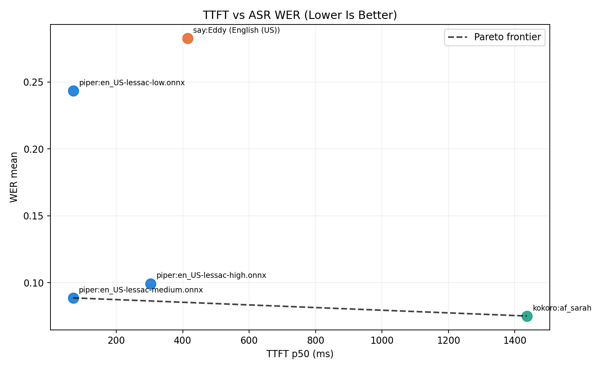
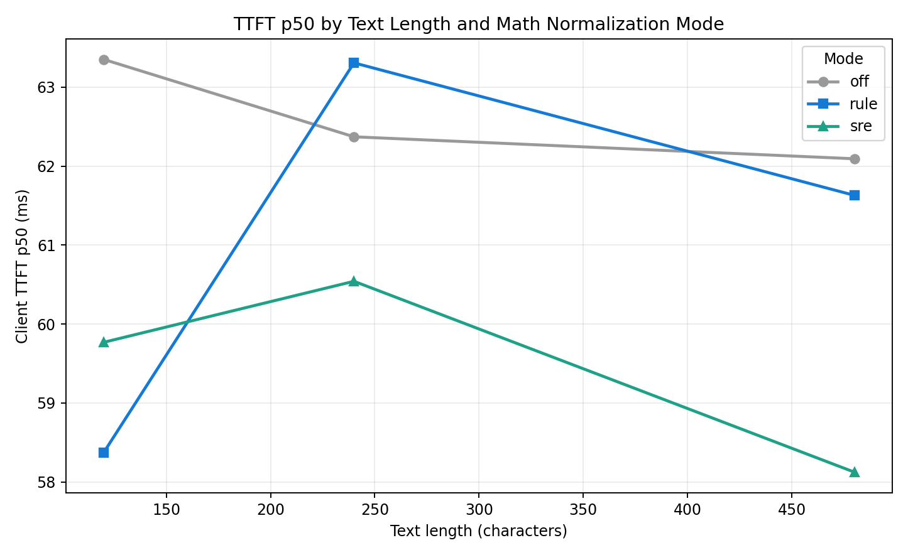
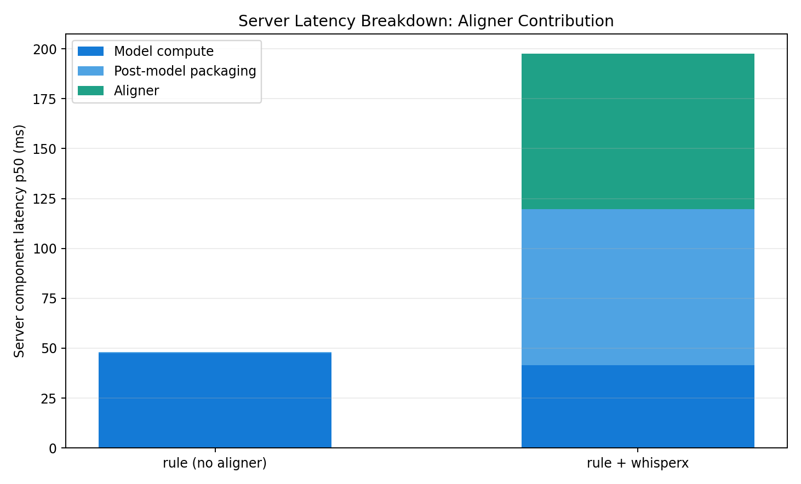
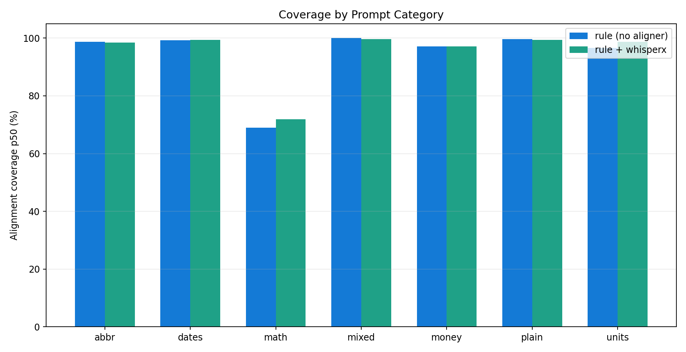

# Polished Evaluation Report

_Generated on 2026-02-10 00:03:08_

## Executive Summary
- Goal: maximize speech quality under strict TTFT constraints for a fully local (on-device) TTS websocket pipeline.
- Best low-latency operating point from current sweeps: **piper/en_US-lessac-medium.onnx**.
- Best frontier point metrics: **TTFT p50 69.8 ms**, **WER mean 0.089**.
- Aligner (`whisperx`) materially increases TTFT: baseline server TTFT p50 58.8 ms vs aligner 132.2 ms.

## Methodology
- Websocket benchmark driver: `benchmark_ttft.py`
- Quality proxy benchmark: `benchmark_model_pareto.py` (ASR WER/CER via `faster_whisper`)
- Input corpus: large mixed set (`experiments/cases_large_template.txt`) and extended category set (`experiments/cases_extended_v1.txt`)
- Chunking policy: ramp plan `4,8,32` with low inter-chunk delay
- Metrics:
  - `client_ttft_recv_ms` for end-user TTFT
  - `server_ttft_audio_out_ms` and component timings (`model`, `aligner`, `post-model`)
  - `alignment_coverage` (analyzed separately from quality proxy)

## Key Figures
### 1) Backend Pareto Frontier


### 2) TTFT by Math Normalization Mode and Length


### 3) Aligner Latency Component Breakdown


### 4) Alignment Coverage by Prompt Category


## Findings
- `piper medium` is currently the strongest low-latency quality point.
- `kokoro` (local int8 ONNX path) improves WER/CER on tested prompts but with much higher TTFT on this hardware/runtime path.
- `say` backend is simple and fully local but underperforms in measured intelligibility and latency.
- `whisperx` alignment is useful for timing fidelity but should be treated as a separate, optional latency tier.

## Product Recommendations
- Default production profile:
  - backend: `piper` + `en_US-lessac-medium.onnx`
  - math mode: `rule`
  - aligner: off by default; optional `whisperx` when subtitle timing precision is required.
- Performance profile variants:
  - **Low-latency mode**: no aligner, small/ramped chunks.
  - **Rich-caption mode**: aligner on, higher receiver idle timeout budget.

## Reproducibility
Generate this report and figures:
```bash
.venv/bin/python experiments/build_polished_report.py
```

Re-run local backend Pareto sweep:
```bash
.venv/bin/python benchmark_model_pareto.py \
  --uri ws://127.0.0.1:8057/tts \
  --math-normalizer rule \
  --chunk-mode ramp --chunk-plan 4,8,32 --delay 0.01 \
  --runs 1 \
  --piper-voices en_US-lessac-low.onnx,en_US-lessac-medium.onnx,en_US-lessac-high.onnx \
  --say-voices "Eddy (English (US))" --say-rate 190 \
  --kokoro-voice-list af_sarah \
  --kokoro-model models/kokoro/kokoro-v1.0.int8.onnx \
  --kokoro-voices-bin models/kokoro/voices-v1.0.bin \
  --json-out experiments/results/pareto_backends_rule_r1_full.json
```
